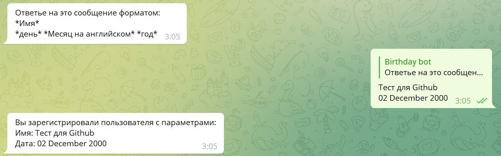
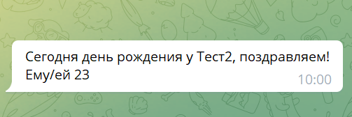

# bro-birthsday-bot

Бот для телеграм-чатов хранящий дни рождения и уведомляющий о них.

[t.me/Birthday_alerting_bot](https://t.me/Birthday_alerting_bot)

### Стек
- Python
- pyTelegramBotAPI
- Poetry build
- PostgreSQL (Heroku)
- Deploy Heroku

### Доступные команды
- /all - все дни рождения
- /check_birth - Дни рождения текущего месяца
- /create_new_member - регистрация будущего именинник
- /help - помощь
- /start - summary бота
- /delete_member - удаление пользователя

### Добавление записей дней рождений в базу
Для каждого телеграм чата, включая личные сообщения создается свой скоуп к которому привязываются созданные в нем записи

Создание записей валидируется на формат ввода, что исключает загрузку в базу плохих данных
### Алертинг о днях рождения

Каждый день в 10 утра по московскому времени (-3 часа по серверу) определяется разница текущей даты с актуальной выгрузкой данных из БД. При совпадении отправляется сообщение с подравлением

